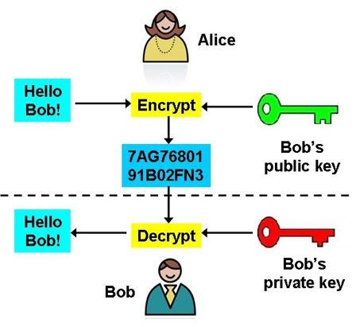
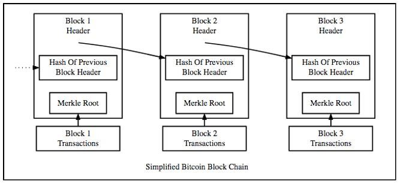
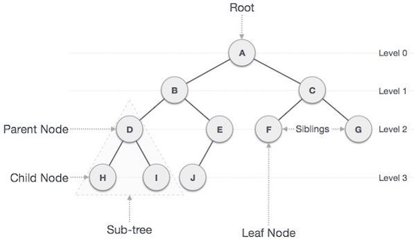
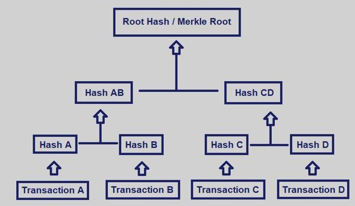
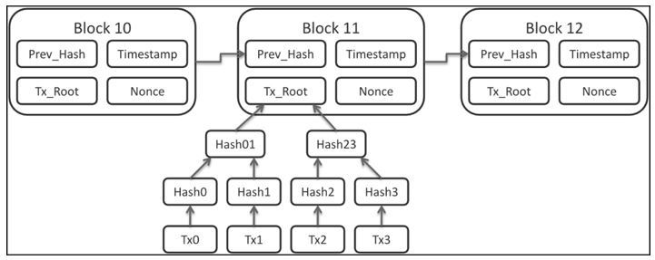

# Basic Cryptography

## What is Cryptography?

Cryptography is the practice of developing protocols that prevent third parties from viewing private data. Modern cryptography combines the disciplines of math, computer science, physics, engineering, and more. Some important terms are defined below:

**Encryption**: Encoding text into an unreadable format.
**Decryption**: Reserving encryption – converting a jumbled message into its original form.
**Cipher**: An algorithm for performing encryption or decryption, usually a well-defined set of steps that can be followed.
Cryptography before the modern age was synonymous to encryption – the process of converting information from a readable format to something that makes no sense. Encryption techniques date back as far as the ancient Egyptians, and have roots spanning all throughout history.

For example, the [Caesar Cipher](http://practicalcryptography.com/ciphers/caesar-cipher/) is a famous cipher used by Julius Caesar to securely communicate with his generals. The cipher "shifts" each letter in a message by a certain amount – with a shift of 2, A would become C, B would become D, and so on.

Blockchain technology makes use of cryptography in multiple different ways – for wallets, transactions, security, and privacy-preserving protocols. This article will cover some important cryptography topics that relate to blockchain technology including public-key cryptography, hashing, and Merkle trees.

## Public-Key Cryptography
Public-key cryptography (also called asymmetric cryptography) is a cryptographic system that uses a pair of keys – a public key and a private key. The public key may be widely distributed, but the private key is meant to be known only by its owner. Keys are always created in a pair – every public key must have a corresponding private key.

Public-key cryptography is most often used for encrypting messages between two people or two computers in a secure way. Anyone can use someone’s public key to encrypt a message, but once encrypted, the only way to decrypt that message is by using the corresponding private key.

Let’s say Alice wants to send an encrypted message to Bob. It would work like this:

* Alice uses Bob’s public key to encrypt the message.
* Alice sends the encrypted message to Bob – if a third party intercepted it, all they would see is random numbers and letters.
* Bob uses his private key to decrypt and read the message.

A diagram illustrating this process is shown below:

Public-key cryptography is a fundamental element of blockchain technology – it is the underlying technology for wallets and transactions. When a user creates a wallet on a blockchain, they are generating a public-private key pair.

The address of that wallet, or how it’s represented on the blockchain, is a string of numbers and letters generated from the public key. Due to the nature of blockchain technology, this address is public to everyone and can be used to check the balance in that wallet or send coins to it.

The private key associated with a wallet is how to prove ownership and control the wallet. It is the only way to send coins out of it, and a lost private key means the coins inside will be stuck there forever.

A transaction on the blockchain is nothing more than a broadcasted message that essentially says, “Take X coins from my wallet and credit X coins into another wallet". Once confirmed, the transaction is immutably written into the ledger, and the balances are updated.

However, this transaction message requires a signature from the private key of the sending wallet to be valid. After broadcasting, anyone can use that wallet’s public key to ensure the digital signature coming from the private key is authentic. This is one role of block validators before they add any transaction (i.e. message) to the blockchain.

## Cryptographic Hashing

Cryptographic hashing is another fundamental piece of blockchain technology and is directly responsible for producing immutability – one of blockchain’s most important features.

Hashing is a computer science term that means taking an input string of any length and producing a fixed length output. It doesn’t matter if the input to a certain hash function is 3 or 100 characters, the output will always be the same length.

Cryptographic hash functions* are hash functions that have these crucial properties:

* **Deterministic**: No matter how many times you give the function a specific input, it will always have the same output.
* **Irreversible**: It is impossible to determine an input from the output of the function.
* **Collision resistance**: No two inputs can ever have the same output.

Another important feature of cryptographic hash functions is that changing any bit of data in the input will drastically alter the output. For example, the hash outputs of 111111 and 111112 would be completely unique and have no relation to each other.

The most widespread use case for cryptographic hash functions is password storage. Most websites do not store your raw password – they store a hash of your password and simply check if the hash matches when you enter it on a given site visit. If a hacker breaks into their database, they will only have access to the irreversible password hashes.

So, how does cryptographic hashing enable immutability for blockchain technology? The answer is that every new block of data contains a hash output of all the data in the previous block.

Imagine a blockchain that just added its 1000th block. The data from block 999 exists in block 1000 as a hash function output. However, included in block 999’s data is a hash of block 998’s data, which contains a hash of block 997’s data.

By traversing the hashes backwards, every block from 1000 to 1 is linked by cryptographic hashing. A diagram of this architecture is shown below:

This is ultimately what makes the data in a blockchain immutable. If someone tried to change just 1 bit of data in any past block, it would not only alter the hash output of that blocks data, but every block after it. Miners and nodes on the network would immediately notice the resulting hashes don’t match their version of the chain and reject the change.

*For reference, Bitcoin uses a cryptographic hash function called [SHA-256](https://en.bitcoin.it/wiki/SHA-256) and Ethereum uses [keccak256](https://eth-hash.readthedocs.io/en/latest/).

## Merkle Trees
The above diagram is a simplified version of a blockchain that leaves out some important information. It has an arrow to show that each block’s transactions are stored in a Merkle root, which is the root node of a Merkle tree.

For context, a tree is a computer science term for storing data in a hierarchical tree-like structure where bits of data are called nodes. There is a single root (top) node that has “child" nodes linked under it, which themselves have child nodes, and so on. A diagram illustrating a typical tree data structure is shown below:

As the diagram shows, groups of nodes within the tree are called sub-trees and a node with no children (no data under it) is called a leaf node.

A Merkle tree (or hash tree) is a tree that utilizes cryptographic hash functions to store hash outputs instead of raw data in each node. Each leaf node consists of a cryptographic hash of its original data, and every parent node is a hash of the combination of its child node hashes.

The Merkle root is simply the root (top) node of a Merkle tree, meaning it represents a hash output of the combined hashes of the left and right sub-trees. A diagram of a Merkle tree with 4 leaf nodes is shown below:

Each leaf node represents a hash of the data for transactions A, B, C, and D. Then hash A and hash B are combined and hashed to produce hash AB, and hash CD is produced in the same way. Finally, hash AB and hash CD are combined and hashed to form the Merkle root of the tree.

So why are Merkle trees important for blockchain technology?

Using the Merkle root and applying the properties of cryptographic hash functions, one can quickly tell if transactions in a given block have been tampered with and the specific transaction that is being tampered.

If a single transaction in a confirmed block is altered, the Merkle root would end up being completely different from the "correct" Merkle root and the tampering would be obvious.

Merkle trees also allow users to verify that their transaction has been included in a block without downloading the entire blockchain. Processes such as [Simplified Payment Verification](https://en.bitcoinwiki.org/wiki/Simplified_Payment_Verification) are able to traverse branches in the Merkle tree and check if a certain transaction has been hashed into that tree. This level of efficiency for blockchain technology would be impossible without including a Merkle root in each block.

An example Merkle tree of 4 transactions in a blockchain is shown below (in this diagram, Tx_Root is the Merkle root):

## Conclusion

Cryptography is an integral part of the inner-workings of blockchain technology. Public-key encryption serves as the basis for blockchain wallets and transactions, cryptographic hash functions provide the trait of immutability, and Merkle trees organize transactions while enabling blockchains to be more efficient.
